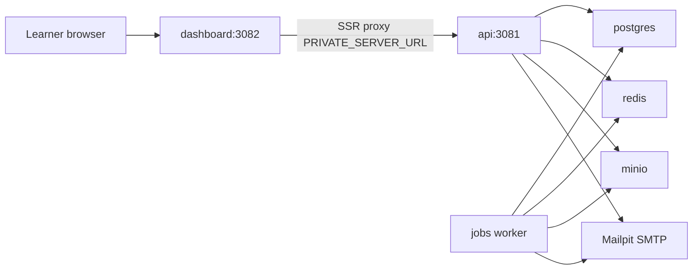

# Architecture — Agentic Bio Classroom

Local-first self-hosted ClassroomIO for The Agentic Bio Fellowship. Learners use the dashboard origin only. The API is an internal service.

## Stack

| Role | Service | Image / engine | Local port |
|---|---|---|---|
| LMS UI | `dashboard` | `classroomio/dashboard:1.0.0` | 3082 |
| API | `api` | `classroomio/api:1.0.0` | 3081 (proxied by dashboard) |
| Background jobs | `jobs` | `classroomio/jobs:1.0.0` | none |
| Database | `postgres` | `postgres:16-alpine` | 5432 |
| Cache / queues | `redis` | `redis:7-alpine` (AOF) | 6379 |
| Object storage | `minio` | `minio/minio` | 9000 API, 9001 console |
| Bucket bootstrap | `minio-init` | `minio/mc` | one-shot, then exits |
| Local email | `mailpit` | `axllent/mailpit` | 8025 UI, 1025 SMTP |

Pinned release: **ClassroomIO 1.0.0** (Docker Hub, amd64 + arm64). Do not use `ghcr.io/classroomio/*` — those tags are not the published self-host images. Do not use compose env vars `PUBLIC_API_URL`, `PUBLIC_DASHBOARD_URL`, or `BETTER_AUTH_URL`; ClassroomIO reads `DASHBOARD_ORIGIN`, `PRIVATE_SERVER_URL`, `PRIVATE_SERVER_KEY`, and `BETTER_AUTH_SECRET`.

## Request path (local)

The dashboard makes auth first-party. Better Auth sets host-only cookies on the dashboard origin. Learners never need a public API hostname.

## Why the jobs worker is required

`jobs` is a BullMQ worker on Redis. It drains:

- video probe, thumbnails, transcoding
- transcription / captions (needs `OPENAI_API_KEY`)
- AI course generation
- invites and most non-auth email
- periodic cleanup

If `cio-jobs` is stopped, the UI still accepts uploads and “send invite,” but work sits in Redis with no error. The in-course AI tutor chat runs inside the API and does not need the worker.

## Auth and email

| Layer | Local | Production later |
|---|---|---|
| Learner / faculty login | ClassroomIO BetterAuth | Same |
| Signup, reset, invites | Mailpit at `:8025` | Real SMTP (Resend, Postmark, Zoho) |
| Edge perimeter | None | Cloudflare Tunnel (`deploy/docker-compose.prod.yml`); Access **staff-only** if used |

Cloudflare Access one-time PIN is **not** ClassroomIO email. Putting Access OTP in front of `learn.agenticbio.in` would block new paying students who are not already on an allowlist. Keep BetterAuth as the LMS login. If Access is added later, attach it to MinIO console or `admin.agenticbio.in`.

## Object storage

`minio-init` creates buckets `videos`, `documents`, and `media`, and sets anonymous download on `media`.

Browsers load media from `OBJECT_STORAGE_MEDIA_PUBLIC_BASE_URL`. Locally that is `http://localhost:9000/media`. In production it must be a public HTTPS URL on your domain — `localhost` URLs in lesson pages will break for every remote learner.

## What this repo does not contain

- The ClassroomIO source monorepo (we pull images)
- Cloudflare Tunnel token or DNS (overlay is in `deploy/docker-compose.prod.yml`; start with `./scripts/prod-up.sh`)
- Payment / checkout
