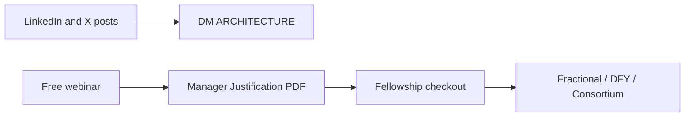

# Launch sequence

Do not launch all five cohorts at once. That splits marketing and delivery. Ship cohort 1 (bioinformatics leaders), fill it, then wrap the same core labs in the next audience skin.

## Funnel

1. **Authority posts** — no external links. Ask for a comment or DM. Hashtags: `#Nextflow` `#Bioinformatics` `#OpenClaw` `#ClinicalTrials` `#ComputationalBiology`. Copy in [MARKETING.md](MARKETING.md).
2. **Priority list** — DM keyword `ARCHITECTURE`. Manual follow-up, not a public checkout URL in the first posts.
3. **Free webinar** — architectural, not a teaser lecture. End with the [justification PDF](justification-one-pager.pdf), not a naked buy link.
4. **Fellowship** — Individual ₹1.5L or Team ₹5L. Delivery in ClassroomIO (`localhost:3082` now; `https://learn.agenticbio.in` after Cloudflare).
5. **Backend** — invite alumni who stall on internal IT into fractional or DFY. Consortium is year-two recurring.

## What this launch does not include

- Razorpay / Stripe checkout
- Public marketing site
- Live Cloudflare Tunnel (compose overlay is in `deploy/`; token and DNS still needed)

Those wait until the first webinar date is set. All five cohort outlines are loadable in local ClassroomIO (`python3 deploy/scripts/seed_cohort1.py --draft …`). Market **one live cohort at a time**; start with cohort 1.

## Delivery capacity

One live cohort at a time. Recordings live in ClassroomIO. Enterprise team seat includes one 60-minute architecture call per org, scheduled after week 3 so they have enough shared vocabulary to use the hour.
